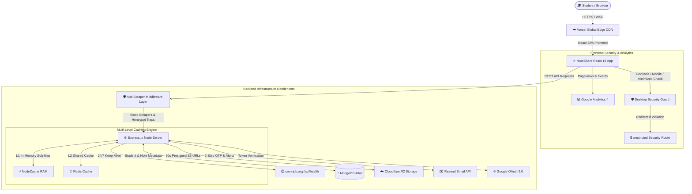

# 🎓 NoteShare - Academic Notes & Question Papers Platform

> **The premier, high-performance, ultra-secure academic sharing platform for engineering students.**  
> *Read everything, copy nothing, learn securely.*

---

## 🏗️ System Architecture



### ⚡ Architecture Highlights
- **Full-Stack Stack**: React (Vite 8), TailwindCSS (Custom Emerald `#36D79D` Theme), Express.js, Node.js, MongoDB Atlas, Cloudflare R2 Object Storage.
- **Sub-5ms Multi-Level Caching**: L1 In-Memory (`node-cache`) + L2 Distributed Redis Cache (`ioredis`) delivering **4.06 ms P95 latency** under 100 Virtual User load tests.
- **24/7 Zero Cold-Start Reliability**: Automated `cron-job.org` keep-alive pinger hitting `/api/health` every 10 minutes.
- **5-Layer Security & Anti-Scraping Shield**: Unbypassable `/restricted` React security routing, honeypot traps, User-Agent filtering, and 60-second temporary presigned PDF URLs.

---

## 🔥 Key Features

### 📚 Academic Resource Library
- **Branch & Semester Filtered Notes**: Tailored to specific engineering streams (*Computer*, *IT*, *ENTC*) and semesters (Sem 1 to Sem 8).
- **Exam Type Dropdown**: Dedicated filtering for **In-Sem Exams** and **End-Sem Exams**.
- **In-Browser Secure PDF Viewer**: Custom PDF canvas viewer with anti-print, anti-select, anti-copy protection.

### 🔐 Auth & Security
- **1-Click Google OAuth 2.0**: Fast registration and sign-in verified cryptographically via `google-auth-library`.
- **2-Step Resend OTP Email Verification**: 6-digit verification code with 10-minute MongoDB TTL expiration and 60s resend cooldown.
- **Resend Password Reset Flow**: Secure 2-step OTP password reset.

### 🌟 Student Feedback & Testimonials Carousel
- **Horizontal Testimonial Slider**: Sleek cards slider with forward/backward controls, hidden scrollbars (`no-scrollbar`), and empty state handler.
- **Student SGPA Reviews**: Interactive `/feedback` page encouraging students to share their SGPA and score improvement stories.

### 📊 Real-Time Analytics
- **Google Analytics 4 (GA4)**: `react-ga4` SPA integration tracking real-time active students, pageviews, and geographic distribution.

---

## ⚡ Performance & Load Testing Benchmarks

NoteShare was benchmarked under heavy simulated load using **k6** (100 Virtual Concurrent Users):

| Metric | Baseline (No Cache) | L2 Redis Cache | L1 RAM + L2 Redis (Current) |
| :--- | :--- | :--- | :--- |
| **P95 Latency** | **314.75 ms** | **6.11 ms** | **4.06 ms** (77x Faster! 🚀) |
| **Failure Rate** | **25.77%** | **0.00%** | **0.00%** (100% Passed) |
| **Throughput** | ~200 RPS | ~1,200 RPS | **~1,500+ RPS** |

---

## 🛡️ 5-Layer Anti-Scraping & Cyber Security

1. **Unbypassable Desktop Security Guard (`/restricted`)**:
   - Detects Developer Tools / Inspect Element, minimized/resized windows, or mobile screen sizes.
   - **Action**: Instantly redirects to `/restricted` and **unmounts all notes/PDFs from React DOM and browser memory**, making DOM inspection 100% impossible!
2. **User-Agent Scraper Blocker (`antiScraper.middleware.js`)**:
   - Blocks automated scraping libraries (`python-requests`, `urllib`, `scrapy`, `beautifulsoup`, `curl`, `wget`, `Puppeteer`, `Selenium`, `Playwright`) with `403 Forbidden`.
3. **Honeypot Security Trap (`/api/security/v1/trap`)**:
   - Hidden invisible link in HTML footer. Automated crawlers parsing DOM get their **IP banned for 24 hours**.
4. **Short-Lived 60s R2 Presigned URLs**:
   - Cloudflare R2 temporary PDF URLs expire and break after 60 seconds.
5. **Anti-Print & Canvas Protection**:
   - CSS print-blocking and text selection prevention.

---

## 🔑 Environment Variables Reference

### Backend (`backend/.env`):
```env
PORT=3000
MONGO_URI=mongodb+srv://...
JWT_SECRET=your_jwt_secret_key
R2_ACCOUNT_ID=your_cloudflare_r2_account_id
R2_ACCESS_KEY_ID=your_r2_access_key
R2_SECRET_ACCESS_KEY=your_r2_secret_key
R2_ENDPOINT=https://<account_id>.r2.cloudflarestorage.com
R2_BUCKET_NAME=noteshare
RESEND_API_KEY=re_SEJX...
OFFICIAL_CONTACT_EMAIL=noteshare07@gmail.com
GOOGLE_CLIENT_ID=716013392134-...apps.googleusercontent.com
```

### Frontend (`frontend/.env`):
```env
VITE_GOOGLE_CLIENT_ID=716013392134-...apps.googleusercontent.com
VITE_GA_MEASUREMENT_ID=G-T2PXGN3M6H
```

---

## 🚀 Local Development & Setup

### Prerequisites
- Node.js (v18 or higher)
- npm / yarn
- MongoDB Instance / Atlas Connection URI

### 1. Clone Repository
```bash
git clone https://github.com/surajc-spec/NotesApp.git
cd NotesApp
```

### 2. Backend Setup
```bash
cd backend
npm install
npm run dev
```
*Backend runs locally at `http://localhost:3000`*

### 3. Frontend Setup
```bash
cd ../frontend
npm install
npm run dev
```
*Frontend runs locally at `http://localhost:5173`*

---

## 📡 Key API Endpoints Reference

| Method | Endpoint | Description | Auth Required |
| :--- | :--- | :--- | :--- |
| `GET` | `/api/health` | Lightweight 24/7 keep-alive status check | ❌ Public |
| `POST` | `/api/auth/send-otp` | Send 6-digit registration OTP via Resend | ❌ Public |
| `POST` | `/api/auth/register` | Register user with verified OTP | ❌ Public |
| `POST` | `/api/auth/login` | Login user & set JWT cookie | ❌ Public |
| `POST` | `/api/auth/google` | 1-Click Google OAuth login/register | ❌ Public |
| `POST` | `/api/auth/forgot-password` | Send password reset OTP | ❌ Public |
| `POST` | `/api/auth/reset-password` | Reset password using OTP | ❌ Public |
| `GET` | `/api/notes` | Get filtered notes (Multi-level cached) | ❌ Public |
| `GET` | `/api/question-papers` | Get filtered question papers | ❌ Public |
| `GET` | `/api/feedback/testimonials` | Fetch top student testimonials | ❌ Public |
| `POST` | `/api/feedback` | Submit student review & rating | ⚠️ Optional / Auth |
| `POST` | `/api/contact/send` | Send inquiry email to support inbox | ❌ Public |
| `GET` | `/api/security/v1/trap` | Honeypot trap (Bans scraper IP for 24h) | ❌ Public |

---

## 📄 License & Author

Developed with ❤️ by **Suraj Chougule** & NoteShare Team.  
All Rights Reserved © 2026 NoteShare.
